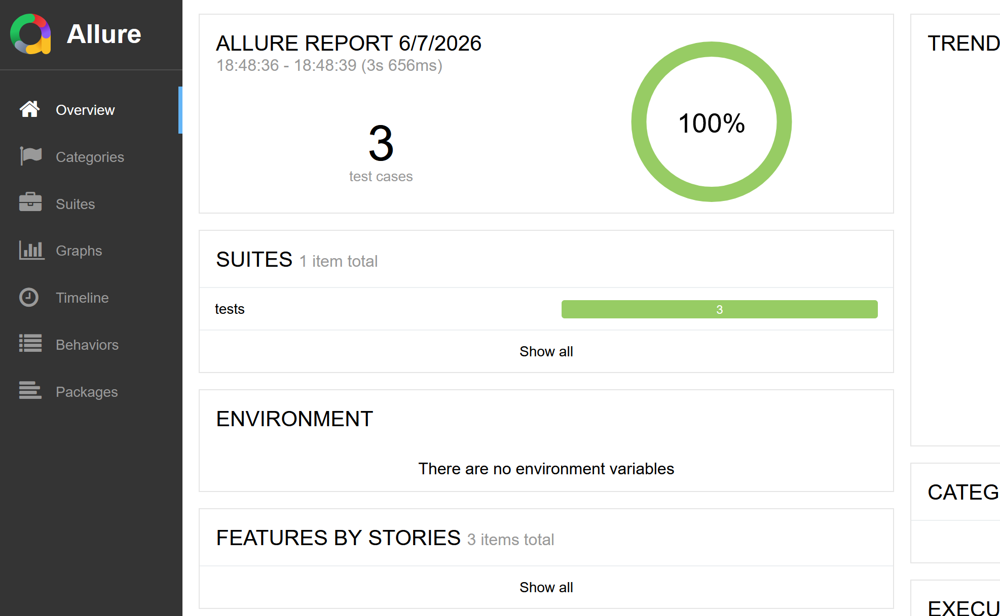
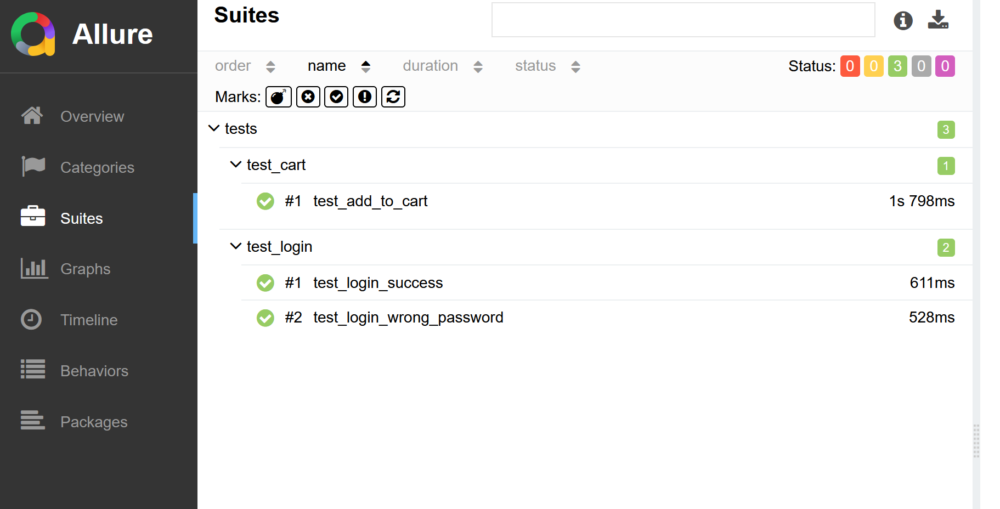
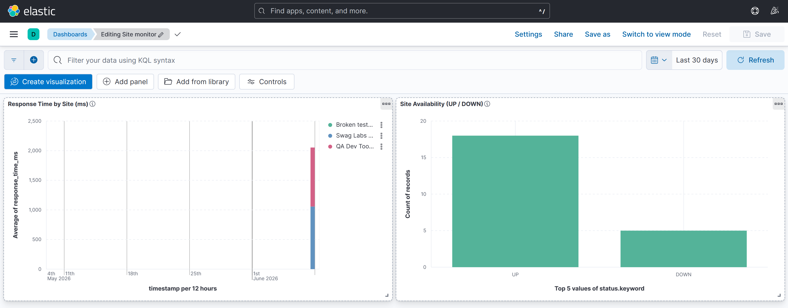
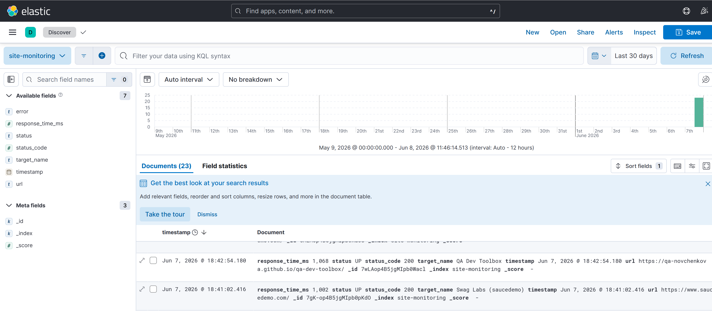
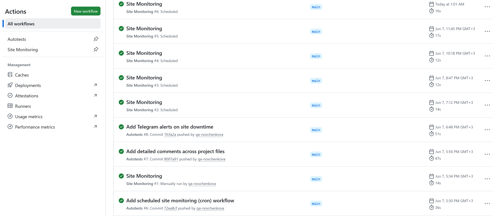
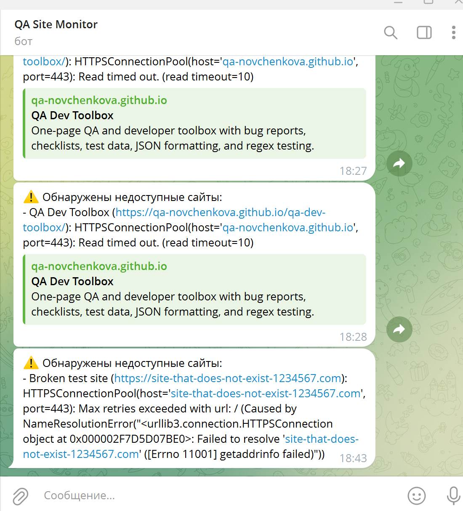

# 🛡️ QA Monitoring

Учебный QA-проект, который объединяет **автоматизированное тестирование** веб-приложения и **мониторинг доступности сайтов** с визуализацией в **Kibana**. Всё автоматизировано через **GitHub Actions** (прогон автотестов при изменениях в коде и проверка сайтов по расписанию) и дополнено **уведомлениями в Telegram** при падении сайта.

Проект сделан для QA-портфолио и показывает полный цикл: автотесты на Selenium с отчётами Allure, внешний мониторинг доступности, хранение метрик в Elasticsearch, дашборды в Kibana, CI/CD и оповещения.

## 🔗 Ссылки

- **Allure-отчёт (онлайн):** https://qa-novchenkova.github.io/qa-monitoring/
- **Репозиторий:** https://github.com/qa-novchenkova/qa-monitoring

## 🖼️ Скриншоты

### Allure — отчёт по автотестам




### Kibana — дашборд мониторинга




### GitHub Actions — автотесты и мониторинг


### Telegram — уведомление о падении сайта


## 📌 О проекте

Проект состоит из двух независимых направлений с разными задачами и инструментами.

| | Автотесты | Мониторинг |
|---|---|---|
| **Вопрос** | Работает ли логика сайта? | Доступен ли сайт и как быстро отвечает? |
| **Тип проверки** | Сценарии (логин, корзина) | Внешняя проверка доступности (UP/DOWN) |
| **Запуск** | `pytest` | `python monitor/monitor.py` |
| **Инструменты** | Selenium, pytest, Page Object | requests, Elasticsearch, Kibana |
| **Отчёт** | Allure (локально + GitHub Pages) | Дашборд Kibana |

Объект для автотестов — учебный магазин [saucedemo.com](https://www.saucedemo.com/); мониторинг следит за задеплоенным [QA Dev Toolbox](https://qa-novchenkova.github.io/qa-dev-toolbox/) и saucedemo.

## ✅ Что реализовано

**Автотесты (Selenium + pytest):**
- структура с паттерном **Page Object** (локаторы и действия вынесены в классы страниц);
- фикстура для запуска/закрытия браузера, поддержка **headless** для CI;
- основные сценарии: успешный вход, вход с неверным паролем, добавление товара в корзину;
- отчёты **Allure** с публикацией на **GitHub Pages**.

**Мониторинг доступности (универсальный инструмент):**
- список сайтов вынесен в конфиг `targets.yaml` — подключение нового сайта без правки кода;
- проверка HTTP-статуса и времени ответа, статус **UP/DOWN**, структурированный JSON-лог;
- отправка метрик в **Elasticsearch** и визуализация в **Kibana** (время ответа, доступность);
- запуск по расписанию (**cron**) в GitHub Actions и **Telegram-уведомления** при падении.

## 🗂️ Структура проекта

```
qa-monitoring/
├─ .github/workflows/
│  ├─ tests.yml          # CI: автотесты + публикация Allure на GitHub Pages
│  └─ monitor.yml        # CI: мониторинг сайтов по расписанию (cron) + Telegram
├─ docker/
│  └─ docker-compose.yml # Elasticsearch + Kibana
├─ pages/                # Page Object — описания страниц сайта
│  ├─ login_page.py
│  └─ inventory_page.py
├─ tests/                # автотесты
│  ├─ test_login.py
│  └─ test_cart.py
├─ monitor/
│  ├─ monitor.py         # монитор доступности + Telegram-алерт
│  └─ targets.yaml       # конфиг: список сайтов для проверки
├─ conftest.py           # фикстура pytest (браузер)
├─ pytest.ini
└─ requirements.txt
```

## 🧰 Стек

- **Python**, **Selenium**, **pytest**, **Page Object**
- **Allure** — отчёты по автотестам
- **requests**, **PyYAML** — монитор доступности
- **Elasticsearch + Kibana** (в **Docker**) — хранение и визуализация метрик
- **GitHub Actions** — CI/CD (автотесты при пуше, мониторинг по cron)
- **GitHub Pages** — публикация Allure-отчёта
- **Telegram Bot API** — уведомления о падении

## 🚀 Локальный запуск

```bash
# 1. Клонировать и подготовить окружение
git clone https://github.com/qa-novchenkova/qa-monitoring.git
cd qa-monitoring
python -m venv venv
source venv/Scripts/activate          # Windows-Bash; Linux/Mac: source venv/bin/activate
pip install -r requirements.txt

# 2. Автотесты (нужен установленный Chrome)
pytest -v
pytest --alluredir=allure-results
allure serve allure-results

# 3. Мониторинг + Kibana (нужен Docker Desktop)
cd docker && docker compose up -d && cd ..
python monitor/monitor.py
# открыть http://localhost:5601 и создать Data View "site-monitoring"
```

## ⚙️ CI/CD (GitHub Actions)

- **Autotests** (`tests.yml`) — при каждом пуше в `main`: прогон автотестов в headless-режиме и публикация Allure-отчёта на GitHub Pages.
- **Site Monitoring** (`monitor.yml`) — по расписанию (cron): проверка сайтов; при недоступности прогон завершается ошибкой (сигнал) и отправляется уведомление в Telegram.

## 🔐 Безопасность

- Токен Telegram-бота и chat_id хранятся в **GitHub Secrets** и переменных окружения, **не в коде**.
- `.gitignore` исключает из репозитория служебные файлы (venv, логи, кэш).
- Монитор устойчив к сбоям: недоступность Elasticsearch или Telegram не роняет программу.
